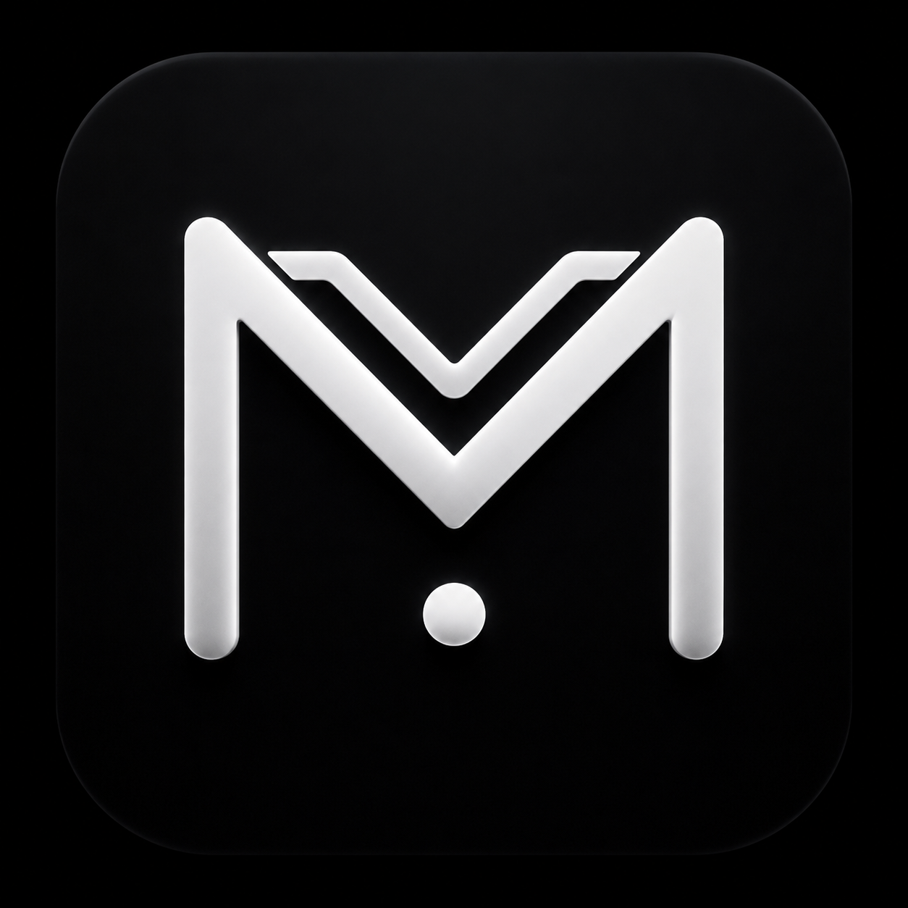
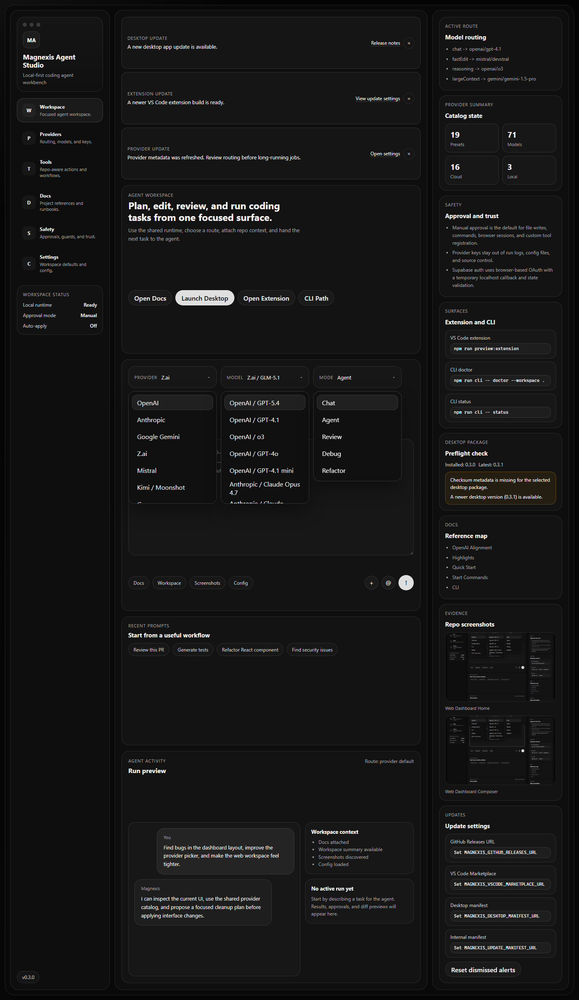
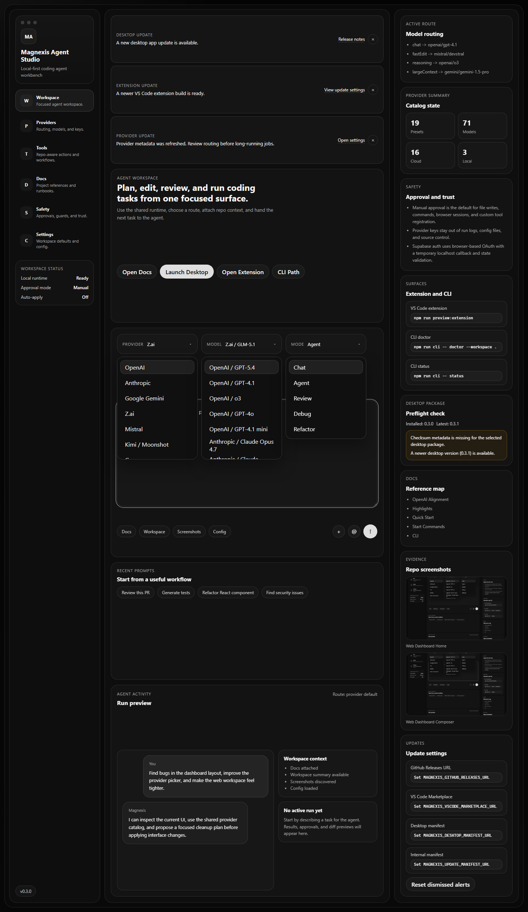
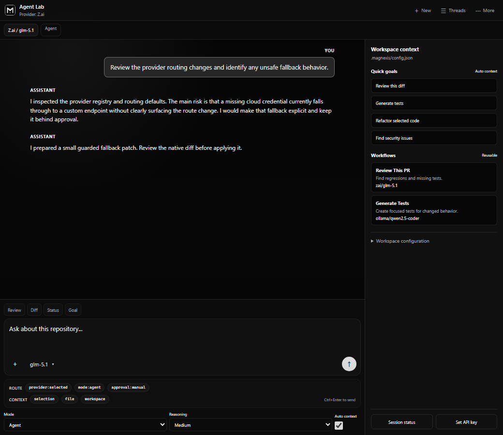

<p align="center">
  
</p>

<h1 align="center">Magnexis Agent Studio</h1>

<p align="center">A local-first coding-agent workbench for VS Code, desktop, web, and CLI.</p>

<p align="center">
  
  
  
  
  
  <a href="CONTRIBUTING.md"></a>
  <a href="SECURITY.md"></a>
</p>

Magnexis Agent Studio is an original developer tool for working with coding agents across multiple surfaces. It combines:

- a VS Code-native chat and agent companion
- a desktop workspace for provider management, run inspection, and settings
- a focused web workbench for launching coding tasks
- a local CLI for provider checks, doctor commands, and scripted runs

Magnexis is a connector, not an LLM provider. It does not host its own model, inference endpoint, or hidden routing layer. It connects your workspace to the provider and model you choose under your own credentials.

Version `0.4.0` includes:

- the VS Code Agent Lab experience
- the Electron desktop workbench
- the web dashboard workspace
- shared provider and model routing
- verified model-context metadata
- per-model local guardrails
- Supabase-based local auth scaffolding
- update notification plumbing
- release bundling for previews, docs, media, and VSIX packaging

## Table of Contents

- [Why Magnexis](#why-magnexis)
- [Surface Previews](#surface-previews)
- [What You Can Do](#what-you-can-do)
- [Architecture at a Glance](#architecture-at-a-glance)
- [Supported Providers](#supported-providers)
- [Quick Start](#quick-start)
- [Run Each Surface](#run-each-surface)
- [Authentication Setup](#authentication-setup)
- [Configuration](#configuration)
- [Safety Model](#safety-model)
- [Release Workflow](#release-workflow)
- [Monorepo Layout](#monorepo-layout)
- [Troubleshooting](#troubleshooting)
- [Contributing and Security](#contributing-and-security)
- [Status](#status)

## Why Magnexis

Magnexis is designed for people who want a serious coding-agent product shape without handing control over to a black box. The product direction is:

- local-first by default
- approval-first for file edits and command execution
- multi-provider instead of model-locked
- repo-aware across editor, desktop, web, and CLI
- original Magnexis branding and implementation rather than copied product code or assets

Where Magnexis talks to OpenAI directly, it follows the current official OpenAI Node SDK pattern:

- Node package: `openai`
- preferred API path: `Responses API`
- standard env var: `OPENAI_API_KEY`
- CLI override support: `--api responses` or `--api chat-completions`

For non-OpenAI providers, Magnexis preserves its OpenAI-compatible routing path so local and third-party endpoints continue to work.

## Surface Previews

These are real project screenshots stored in the repository so the GitHub README shows the current UI rather than mockups.

### Web Workspace

<p align="center">
  
</p>

<p align="center">
  
</p>

The web dashboard is the focused agent workspace. It centers the composer, model/provider routing, context controls, safety state, and route inspector instead of trying to be a generic analytics dashboard.

### VS Code Agent Lab

<p align="center">
  
</p>

The VS Code surface is designed for compact sidebar use and split-panel use. It includes thread switching, provider selection, current-file and workspace context, slash commands, diff-aware flows, and auth-aware status controls.

## What You Can Do

### Across the product

- connect external LLM providers with your own API keys
- select verified models and inspect known context-window metadata
- chat with repository context
- plan coding tasks before applying changes
- review diffs before accepting edits
- keep terminal and file edits behind approval gates
- track workflow templates and route preferences

### In VS Code

- open the Agent Lab sidebar
- run chat beside the editor or in a separate window
- attach current file, selection, or workspace context
- switch providers and models from the in-product picker
- restore sessions and use protected commands through the shared auth layer

### In Desktop

- manage providers in a higher-bandwidth workspace
- review model stats and route settings
- inspect agent activity, settings, and tool capabilities
- use the integrated `llm-stats.com` viewport inside the native shell

### In Web

- start focused coding tasks from a clean agent-workspace surface
- inspect safety, docs, and route summaries from the right-side inspector
- use branded dropdowns with provider marks and model routing context

### In CLI

- run provider and workspace diagnostics
- inspect current routing
- launch scripted runs for review or planning flows

## Architecture at a Glance

Magnexis is organized as a monorepo:

```text
apps/
  desktop/           Electron desktop workbench
  vscode-extension/  Extension app wrapper and package metadata
  web-dashboard/     Focused browser workspace

packages/
  agent-core/        Shared agent orchestration primitives
  auth/              Supabase-backed auth provider and callback flow
  config/            Shared config model and defaults
  indexer/           Workspace indexing helpers
  llm-router/        Provider presets, verified models, routing metadata
  shared/            Shared utilities
  tools/             Tool contracts and registration model
  types/             Shared TypeScript contracts
  ui/                Shared UI tokens and metadata

src/
  VS Code runtime host, webview glue, CLI commands, settings, tools

media/
  Shared branding, provider marks, CSS, and webview script
```

The current codebase keeps the shared product language in the packages while each surface consumes the same routing, provider, config, and auth ideas.

## Supported Providers

Magnexis currently exposes `19` provider presets:

- OpenAI
- Anthropic
- Google Gemini
- Z.ai
- Mistral
- Kimi / Moonshot
- Groq
- OpenRouter
- Together AI
- DeepSeek
- xAI
- Perplexity
- Cerebras
- Fireworks AI
- SambaNova
- NVIDIA NIM
- Ollama
- LM Studio
- Custom OpenAI-compatible endpoint

Important distinction:

- Magnexis provider presets are routing presets
- verified model metadata is pinned where official docs are available
- local and gateway routes stay marked as endpoint-reported rather than invented

For provider policy and verified-model notes, see [docs/PROVIDERS.md](docs/PROVIDERS.md).

## Quick Start

Requirements:

- Node.js 20+
- npm
- VS Code 1.92+
- Python with Playwright only when regenerating screenshots

Install and compile:

```powershell
npm install
npm run compile
```

## Run Each Surface

### Primary start commands

```powershell
npm run start:extension
npm run start:desktop
npm run start:web
npm run start:cli
```

### Preview-oriented commands

```powershell
npm run start:extension:preview
npm run start:desktop:preview
npm run start:web:preview
```

### CLI examples

```powershell
npm run cli -- status
npm run cli -- doctor --workspace .
npm run cli -- providers openai
npm run cli -- run "Review this repository and summarize the main risks." --provider openai --api responses
```

After `npm link`, you can call:

```powershell
magnexis status
magnexis run "Summarize this repo" --provider openai --api responses
```

### VS Code extension

1. Open this repository in VS Code.
2. Press `F5`.
3. Choose **Run Magnexis Agent Lab**.
4. In the Extension Development Host, run **Magnexis: Open Sidebar**.
5. Use **Magnexis: Pin Chat Near Editor** or the pin button in the Agent Lab header to keep the chat beside your code.
6. Open the provider picker, select a provider and model, then save the API key.

Build and install the VSIX:

```powershell
npm run package
code --install-extension magnexis-agent-studio-0.4.0.vsix --force
```

### Desktop application

```powershell
npm run desktop
```

The desktop runtime stores provider keys through Electron `safeStorage`. The Model Stats area embeds `llm-stats.com` in a restricted native view.

## Authentication Setup

Magnexis includes a shared Supabase-backed auth layer for VS Code and desktop with:

- email/password sign-in
- sign-up
- GitHub OAuth when configured
- Google OAuth when configured
- localhost callback capture
- secure session restore
- protected feature gating

### Environment

Copy `.env.example` to `.env` and fill in:

```env
SUPABASE_URL=
SUPABASE_ANON_KEY=
AUTH_CALLBACK_URL=http://localhost:54321/auth/callback
AUTH_CALLBACK_PORT=54321
APP_DEEP_LINK_SCHEME=magnexis
MAGNEXIS_GITHUB_RELEASES_URL=
MAGNEXIS_VSCODE_MARKETPLACE_URL=
MAGNEXIS_DESKTOP_MANIFEST_URL=
MAGNEXIS_UPDATE_MANIFEST_URL=
```

### Redirect URLs

In Supabase Auth, configure:

- `http://localhost:54321/auth/callback`
- `magnexis://auth/callback`

### Validation

```powershell
npm run compile
npm run auth:check
```

### VS Code auth flow

- `Magnexis: Sign In`
- `Magnexis: Sign Up`
- `Magnexis: Sign Out`
- `Magnexis: Show Account`
- `Magnexis: Refresh Session`

Sessions are stored in VS Code `SecretStorage`.

### Desktop auth flow

Open **Settings > Account and sync** and use the account actions there. Sessions are stored with Electron `safeStorage` encryption.

## Configuration

Project configuration lives in `.magnexis/config.json`; user-level defaults live in the user's `.magnexis/config.json`. VS Code settings use the `magnexis.*` namespace.

| Setting | Default | Purpose |
| --- | --- | --- |
| `magnexis.provider` | `zai` | Active external provider |
| `magnexis.model` | `glm-5.1` | Model identifier sent to that provider |
| `magnexis.approvalMode` | `agent` | `chat`, `agent`, or `fullAccess` |
| `magnexis.reasoningEffort` | `medium` | Requested planning effort |
| `magnexis.maxToolRounds` | `12` | Maximum model/tool turns |
| `magnexis.commandTimeoutMs` | `120000` | Terminal command timeout |
| `magnexis.autoContext` | `true` | Attach recent editor context |
| `magnexis.maxWorkspaceFiles` | `80` | Workspace-map path cap |
| `magnexis.maxFileBytes` | `24000` | Per-file context byte cap |

Per-model limits are local caps. They are not claims about account-level provider quotas.

## Safety Model

Manual approval is the default posture.

Read-only inspection can run directly, but the following remain guarded:

- workspace edits
- shell commands
- package installation
- browser-control style tools
- custom tool manifests
- sensitive-file changes

Additional security expectations:

- provider keys never belong in Git, config files, or exported logs
- Supabase uses PKCE and a browser-based OAuth flow
- raw passwords, tokens, codes, and service-role keys must never be logged
- full-access mode should only be enabled in trusted workspaces

See [docs/SECURITY.md](docs/SECURITY.md) and [SECURITY.md](SECURITY.md).

## Release Workflow

Package the extension and assemble the release bundle:

```powershell
npm run package
npm run release:bundle
```

Outputs:

- VSIX: `magnexis-agent-studio-0.4.0.vsix`
- local release folder: `dist/releases/magnexis-agent-studio-0.4.0/`
- zipped release bundle: `dist/releases/magnexis-agent-studio-0.4.0.zip`

The release bundle includes:

- docs
- previews
- screenshots
- media assets
- VSIX
- `CHANGELOG.md`
- `RELEASE_NOTES.md`
- `release-manifest.json`

What is not fully automated yet:

- desktop native installers
- VS Code Marketplace publication
- GitHub Releases publication
- signed multi-platform desktop distribution

Those still require external publishing credentials and a real distribution pipeline.

## Monorepo Layout

```text
apps/
  desktop/
  vscode-extension/
  web-dashboard/

packages/
  agent-core/
  auth/
  config/
  indexer/
  llm-router/
  shared/
  tools/
  types/
  ui/

src/
media/
docs/
workspaces/runtime/
```

Reference docs:

- [docs/ARCHITECTURE.md](docs/ARCHITECTURE.md)
- [docs/DEVELOPMENT.md](docs/DEVELOPMENT.md)
- [docs/PROVIDERS.md](docs/PROVIDERS.md)
- [docs/REPO_STRUCTURE.md](docs/REPO_STRUCTURE.md)

## Troubleshooting

### Callback never returns

Make sure `AUTH_CALLBACK_PORT` is free and the redirect URL exactly matches `AUTH_CALLBACK_URL`.

### OAuth provider mismatch

Confirm the same provider is enabled in Supabase and in the flow you launched.

### Missing env variables

Run:

```powershell
npm run auth:check
```

### Expired session

Use `Magnexis: Refresh Session` first. If refresh fails, sign in again.

### Preview port already in use

The preview server automatically falls forward to another local port if `4173`, `4174`, or `4175` are occupied.

### Browser cannot open

Check that the local machine allows VS Code or Electron to open the default system browser.

## Contributing and Security

- contribution flow: [CONTRIBUTING.md](CONTRIBUTING.md)
- root security policy: [SECURITY.md](SECURITY.md)
- implementation security details: [docs/SECURITY.md](docs/SECURITY.md)

## Status

This is an active `0.4.0` development build.

The strongest current path is:

- OpenAI-compatible provider routing
- VS Code Agent Lab workflows
- desktop provider management and model stats
- web workspace previews and release bundling

Still intentionally incomplete:

- cloud sync
- billing
- marketplace publication
- signed desktop installers
- complete remote release automation

## License

Proprietary. See [LICENSE](LICENSE).
